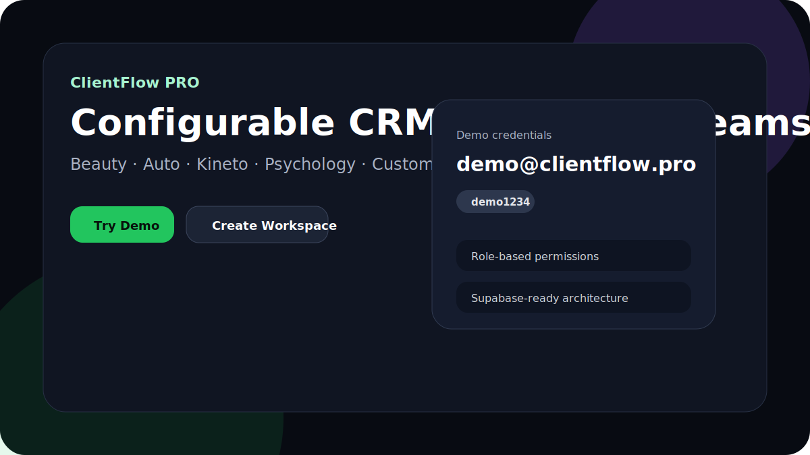
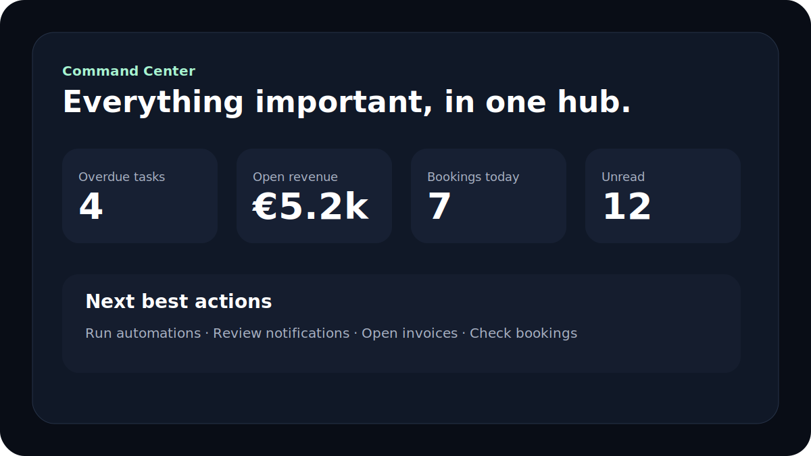
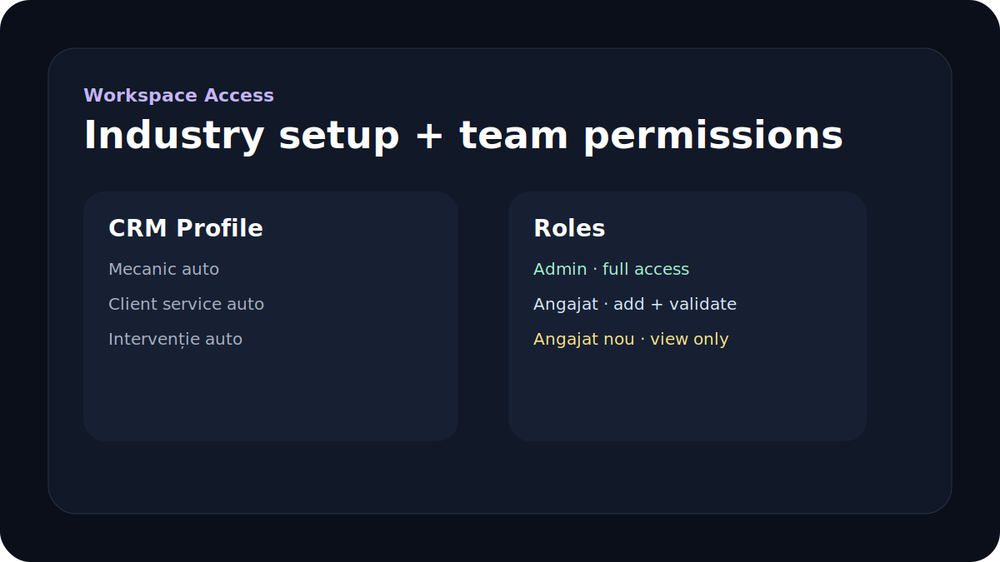
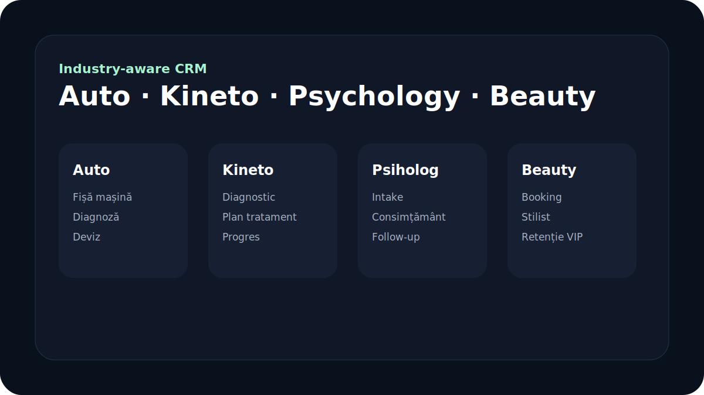
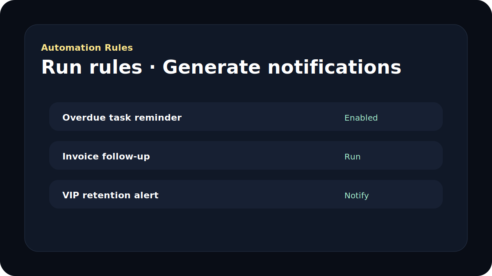
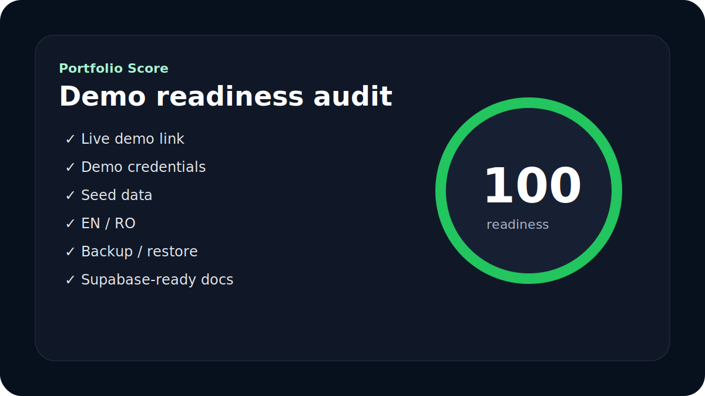

# ClientFlow PRO


> Complete best-of SaaS operations suite — public landing page, Start Here demo flow, workspace onboarding, industry-specific CRM configuration, domain-specific seed data, real rule-based UI permissions, team access roles, invite links, Command Center, global search, automations, notifications, CRM, tasks, invoices, service templates, time tracking, client portal preview, beauty booking studio, reports, calendar, AI Copilot, demo planner, impact goals, portfolio score, backup/restore, bilingual EN/RO interface, Supabase-ready architecture, PWA support, and GitHub Pages-safe routing.

## 🚀 Live Demo

**→ [Open the landing page](https://laurandreea10.github.io/ClientFlow-PRO/#/)**  
**→ [Open the login demo](https://laurandreea10.github.io/ClientFlow-PRO/#/login)**  
**→ [Start the guided demo](https://laurandreea10.github.io/ClientFlow-PRO/#/start-here)**

### Demo credentials

| Field    | Value                 |
| -------- | --------------------- |
| Email    | `demo@clientflow.pro` |
| Password | `demo1234`            |

No account needed. Click **Try Demo** on the landing or login page to enter instantly. All changes are saved locally in your browser.

---

## Portfolio preview



| Command Center | Workspace Access |
| -------------- | ---------------- |
|  |  |

| Industry CRM | Automations |
| ------------ | ----------- |
|  |  |



---

## Product docs

- [Demo Script](docs/DEMO_SCRIPT.md)
- [Product Case Study](docs/PRODUCT_CASE_STUDY.md)
- [Supabase-ready Architecture](docs/SUPABASE_READY.md)

## Why this project stands out

ClientFlow PRO is a portfolio-ready operational dashboard that merges the strongest ideas from:

- **Alpis Fusion CRM Premium** — AI assistant, premium UX, backup/restore, case-study positioning
- **ClientFlow SaaS CRM Task Manager Automation Suite** — client operations, automations, service templates, invoicing, time tracking, client portal
- **ALPIS ImpactPath** — mission, progress and impact storytelling
- **Link Video Editor Studio** — demo readiness, presentation styles, export mindset and product-demo planning
- **Beautyus Premium App** — premium service booking, salon calendar, client desk, retention automations and revenue visibility

The result is a modern React + TypeScript workspace that works without a paid backend, feels like a real product, and gives recruiters or reviewers an instant, resettable demo.

## Product highlights

- **Public landing page** at `/#/` and `/#/landing` with product explanation, industries, roles, demo credentials and CTA buttons
- **Start Here** recruiter flow at `/#/start-here` with the recommended guided demo
- **Demo Script** at `/#/demo-script` plus a Markdown version in `docs/DEMO_SCRIPT.md`
- **Workspace onboarding** from account creation with industry-specific CRM setup
- **Industry templates** for Beauty, Mecanic auto, Kinetoterapeut, Psiholog and Custom CRM
- **Domain-specific demo seed**: Auto, Kineto, Psychology, Beauty and Custom generate relevant clients/tasks at workspace creation
- **Industry-aware CRM UI** in Clients, Tasks, Invoices, Services, Time Tracking, Portal, Impact and Beauty Studio
- **Real rule-based UI permissions**: unsupported Add/Edit/Delete/Status/Run/Restore actions are disabled by role
- **Team access management** with Admin, Angajat and Angajat nou roles
- **Admin invite links**: admin can create employee access and copy/send a ClientFlow PRO link
- **Command Center** for priorities, open revenue, bookings, unread notifications and next-best-actions
- **Global Search** across clients, tasks, invoices, services, bookings, demo plans and impact goals
- **Automation Rules** with local run engine for overdue tasks, sent invoices, beauty reminders, VIP retention and high-value leads
- **Notifications Center** with read/unread state and generated automation notifications
- **Portfolio Score** audit page for recruiter-facing demo readiness
- **Public Portal Preview** route such as `/#/portal-preview/BLOOM-2026`
- **Backup / Restore JSON** in Settings for full local workspace export/import
- **Supabase-ready architecture note** with suggested tables, RLS sketch and migration path
- Bilingual EN/RO interface across core flows
- GitHub Pages-safe routing through `HashRouter`
- PWA-ready manifest, service worker registration and offline fallback

## Recommended demo flow

1. `/#/` → open the public landing page
2. `/#/login` → click **Try Demo**
3. `/#/start-here` → follow the guided demo path
4. `/#/demo-script` → show the 60-second pitch and route plan
5. `/#/command-center` → show operational overview
6. `/#/workspace-setup` → show industry setup, roles and invite links
7. `/#/clients` or `/#/tasks` → show permission-aware UI and industry labels
8. `/#/automations` → run rules and generate notifications
9. `/#/portfolio-score` → close with readiness score

## Workspace and access roles

| Role | Access |
| ---- | ------ |
| Admin | Editează, modifică, șterge, adaugă permisiuni, gestionează accesul și are acces total |
| Angajat | Vizualizează, adaugă și validează status client |
| Angajat nou | View only; Add/Edit/Delete/status actions are disabled in the UI |

Adminul poate crea un profil de acces cu nume, email, rol și permisiuni custom, apoi poate copia linkul `/#/accept-access/:accessId` pentru angajat.

## Industry CRM templates

| Industry | CRM focus | Seed examples |
| -------- | --------- | ------------- |
| Beauty / Salon | Programări, servicii, stiliști, retenție VIP | VIP balayage client, nails returning client, reminder tasks |
| Mecanic auto | Fișă mașină, diagnoză, deviz, reparație, predare | VW Golf 7, BMW X3, deviz, fișă mașină |
| Kinetoterapeut | Diagnostic, plan tratament, ședințe, progres | Recuperare genunchi, durere lombară, reevaluare |
| Psiholog | Intake, consimțământ, tip ședință, confidențialitate | Client intake, consimțământ, follow-up terapeutic |
| Personalizat | Câmpuri, statusuri și etichete CRM configurabile | Client custom și task de configurare flux |

## Included modules

- Landing page and one-click demo mode
- Start Here and Demo Script pages
- Workspace Access, roles and invite links
- Command Center and Global Search
- CRM, Tasks, Services, Invoices and Time Tracking
- Client Portal Preview and public portal preview route
- Beauty Studio booking and retention module
- Automations and Notifications
- Reports, Calendar and Activity Log
- Demo Planner and Impact Goals
- Portfolio Score and Case Study
- Backup / Restore JSON
- Supabase-ready architecture documentation

## Demo data model

| Area | Included demo content |
| ---- | --------------------- |
| Workspace | Industry template, custom CRM labels, statuses, fields and team access profiles |
| Domain seed | Auto/Kineto/Psychology/Beauty/Custom-specific clients and tasks |
| Clients | Active, lead and inactive accounts with tags, pipeline stages, health scores and custom fields |
| Tasks | Todo, in-progress and done tasks with priorities, due dates, recurrence, subtasks and comments |
| Invoices | Draft, sent and paid invoices with printable layout |
| Services | Reusable service templates with pricing, duration and deliverables |
| Time | Local time entries with billable estimate |
| Portal | Simulated client portal access codes and visible sections |
| Beauty Studio | Bookings, stylists, services, spend, retention labels, agenda statuses and CSV export |
| Automations | Enabled rules for tasks, invoices, bookings, VIP retention and high-value leads |
| Notifications | Generated inbox items with read/unread state |
| Demo Planner | Saved demo plans with readiness score and shot lists |
| Impact | Goals with current/target progress tracking |
| Backup | JSON export/import for core workspace and all suite modules |

## Cost model

Required monthly cost: **€0**

- Storage: browser `localStorage`
- Backend: not required for the portfolio demo
- Paid API: not required
- Hosting: GitHub Pages

## Engineering highlights

- TypeScript data models for clients, custom fields, tasks, subtasks, comments, recurrence, suite modules, automations, notifications, workspace profiles and team access roles
- Local data adapter through `mockApi.ts`, designed to be replaceable with a real backend later
- Workspace access, permission and industry seed model through `src/lib/workspaceAccess.ts`
- Suite module storage through `src/lib/suiteStorage.ts`
- Automation rule engine through `src/lib/automationEngine.ts`
- Unified search helper through `src/lib/globalSearch.ts`
- Supabase migration plan through `docs/SUPABASE_READY.md`
- React Query for async state management and cache invalidation
- Reusable toast provider for notifications and undo flows
- First-run onboarding/demo tour persisted in localStorage
- GitHub Actions CI for typecheck and production build

## Quality checks

```bash
npm run typecheck
npm run build
```

## Trade-offs

- Kept the app local-first to avoid cost and deployment complexity
- Access links and permissions are local simulations, not secure production auth yet
- AI Copilot and automations are deterministic and local, not backed by paid APIs
- Client portal links are simulated previews, not public secure links
- Beauty Studio automations are local workflow states, not real SMS/email notifications
- PDF export uses the browser print flow instead of a paid document service
